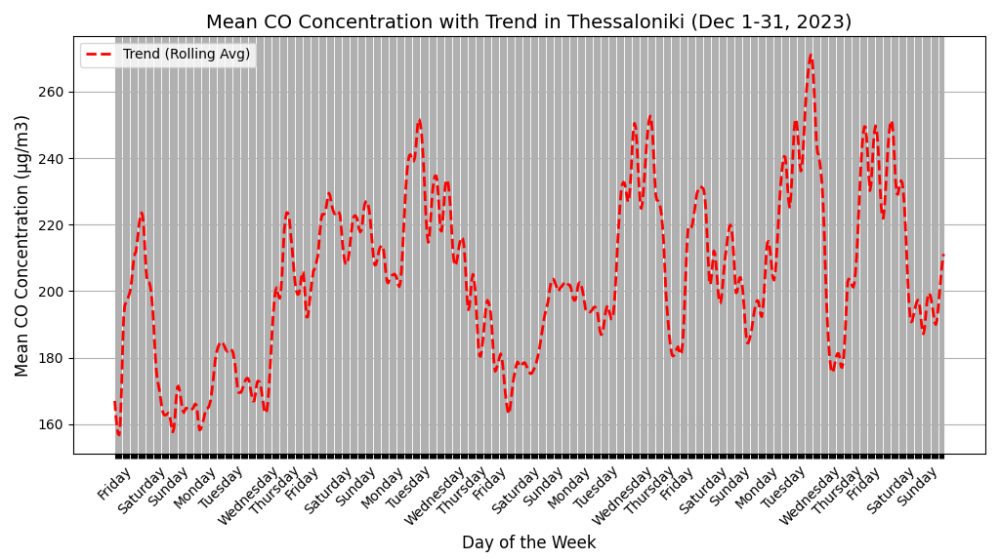

# AirWell: Air Quality-Based Hybrid Work Optimization

## Project Overview

This project, **AirWell**, was created for [Greece Cassini hackathon 2024](https://www.cassini.eu/hackathons/greece) to optimize hybrid working plans based on air pollution data. The app leverages satellite data on air quality and CO emissions to provide companies with actionable insights to ensure employee health and wellbeing, while promoting environmental sustainability.

### Key Features:
- **Air Quality Monitoring**: Track air quality (AQI) in different regions to determine optimal working locations for employees.
- **Hybrid Work Optimization**: Automatically adjust work schedules (home or office) based on real-time pollution data to minimize health risks.
- **Energy & CO2 Savings**: Estimate potential energy savings by optimizing hybrid work strategies.
- **Employee Wellbeing Focus**: Prioritize employee health by reducing exposure to poor air quality environments.

---

## Python Script

The project includes a Python script that processes CO data from [CAMS European air quality reanalyses model](https://ads.atmosphere.copernicus.eu/cdsapp#!/dataset/cams-europe-air-quality-reanalyses?tab=overview) for the Thessaloniki area to calculate **weekly and monthly CO emissions**. This script leverages publicly available satellite data from Copernicus program.

### File:
- `co_emissions_thessaloniki.py`: Script to analyze CO emissions data for Thessaloniki on a weekly and monthly basis. The output is used to adjust hybrid work recommendations for companies in the area.

Charts for CO of December 2023 month and first week of month



---

## Dashboard UI

We used a free and [open-source UI framework](https://github.com/TailAdmin/free-nextjs-admin-dashboard) to design a clean and intuitive dashboard interface for this project.

Here is a screenshot showcasing the UI we have in mind for the project.


---

## Installation

To run the project locally, follow these steps:

1. Clone the repository:
    ```bash
    git clone git@github.com:Job-Rider/cassini-hackathon.git
    cd cassini-hackathon
    ```

2. Install the required Python libraries:
    ```bash
    pip install -r requirements.txt
    ```

3. Run the Python script to generate CO emissions data:
    ```bash
    python co_emissions_thessaloniki.py
    ```

---

## Future Enhancements

- More analysis of air polution data from the Copernicus satellite ecosystem.
- Custom notifications and alerts based on pollution levels.
- Enhanced AI-driven recommendations for individual employee work schedules.

---

## License

This project is licensed under the MIT License.
